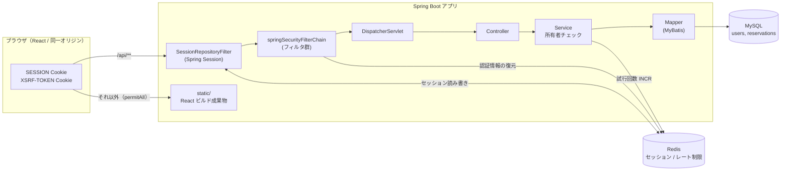
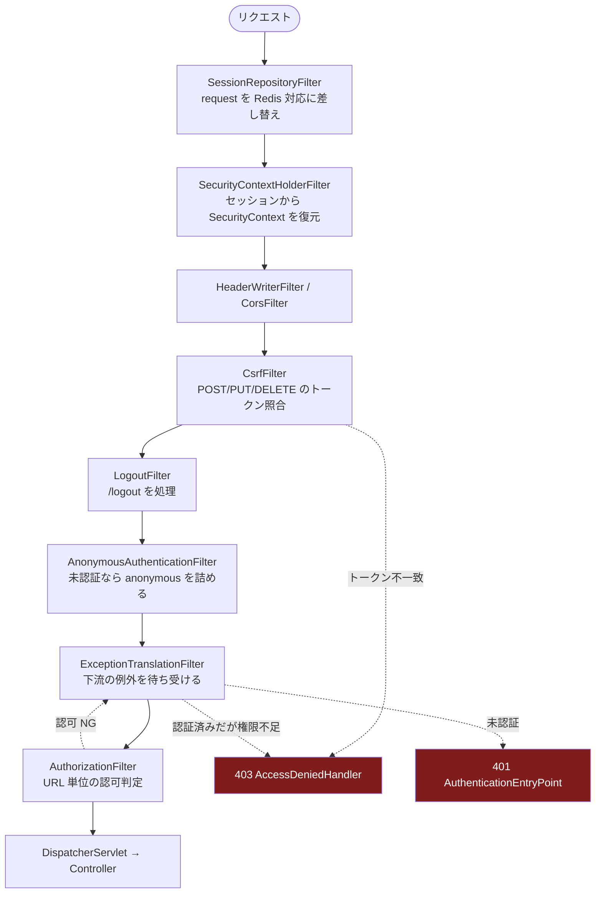
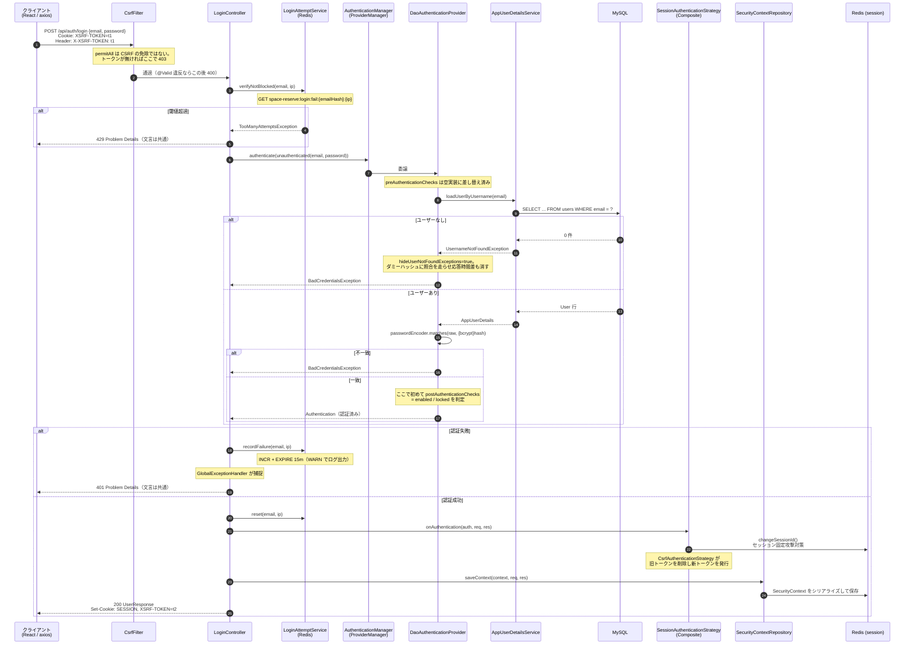
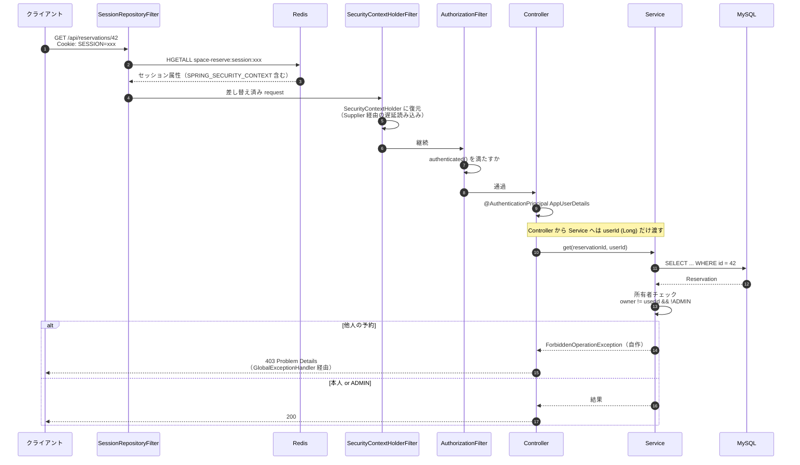
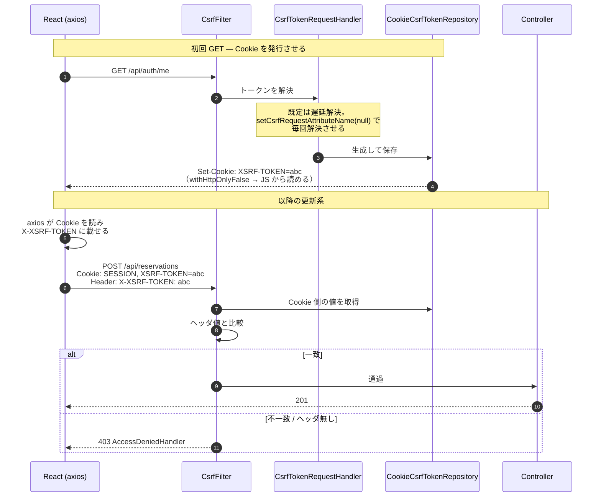
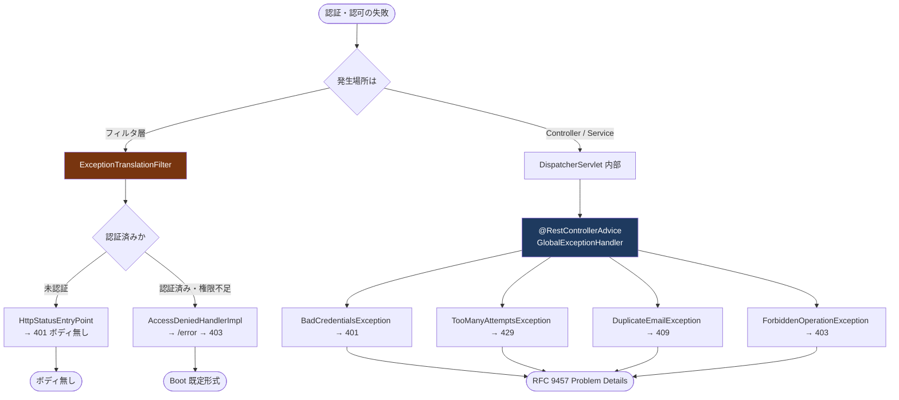
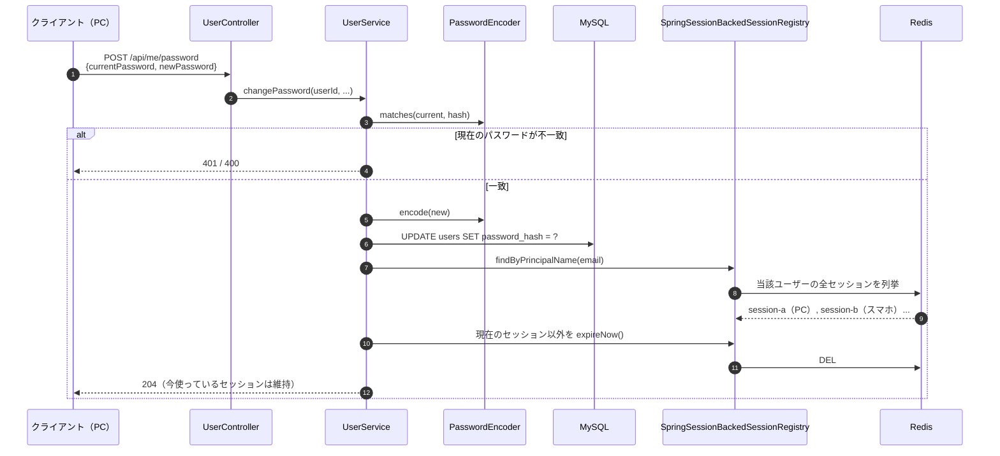
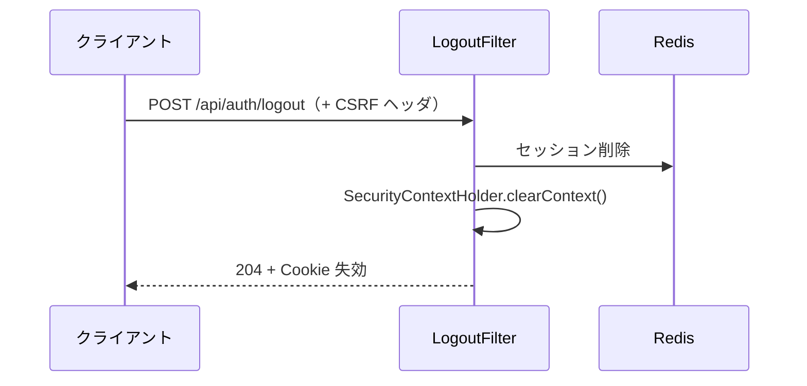
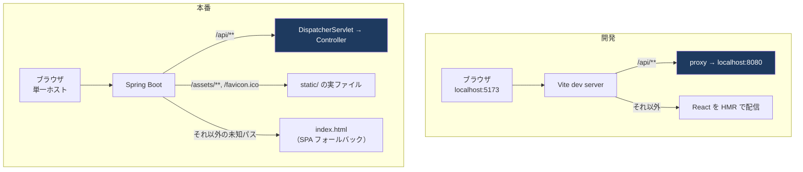

# 認証・認可 フロー図

`authentication.md` で決めた方針が、実行時に Spring Security のどの部品を通るのかを図にしたもの。
判断の根拠は書かない（そちらは `authentication.md`）。ここは **どこで何が起きるか** だけを扱う。

---

## 1. 全体構成



要点は3つ。

- **`SessionRepositoryFilter` は Security のフィルタ群より手前にいる。** Spring Session が `HttpServletRequest` を差し替えるので、以降の `getSession()` は全て Redis を向く。Security 側は自分が Redis を見ていることを知らない。
- **Redis は3用途を兼ねる**（セッション / ログイン失敗カウント / 登録レート制限）。だから `namespace` を明示する。
- **React は同一オリジンで配信し、`/api/**` 以外は認証を通さず `static/` へ抜ける。** ブラウザから見たオリジンが1つなので CORS は登場しない。詳細は 10 節。

---

## 2. フィルタチェーンの並び

`formLogin` を使わないので `UsernamePasswordAuthenticationFilter` は**いない**。ログインは通常の Controller。



**`ExceptionTranslationFilter` が `AuthorizationFilter` より上流にいる**のがポイント。下流で投げられた `AccessDeniedException` をここで受け止め、「未認証なら 401、認証済みなら 403」に振り分ける。この分岐が 8 節の「所有者チェックに Spring の `AccessDeniedException` を使わない」理由。

---

## 3. ログイン

**この節は実装済みの挙動を示す**（他の節は着手前の設計のまま）。対応する実装は
[`LoginController`](../../backend/src/main/java/com/example/spacereserve/controller/LoginController.java) と
[`SecurityConfig`](../../backend/src/main/java/com/example/spacereserve/security/SecurityConfig.java)、
実行可能な形での記録は
[`LoginControllerTests`](../../backend/src/test/java/com/example/spacereserve/controller/LoginControllerTests.java)。



赤線を引くところ:

- **`saveContext` を自分で呼ぶ。** `formLogin` を使わない代償。忘れるとログインは 200 で返るのに、次のリクエストが 401 になる。
- **`enabled` の判定はパスワード照合の後。** 既定の順序のままだと、パスワードが違っても「無効なアカウント」と返ってアドレスの存在が漏れる。
- **失敗系の応答はすべて同じ形。** 「存在しない」と「パスワード違い」を区別しない。
- **振り直すのはセッション ID と CSRF トークンの2つ。** `formLogin` なら `CompositeSessionAuthenticationStrategy` が `ChangeSessionIdAuthenticationStrategy` と `CsrfAuthenticationStrategy` の両方を回す。自前ログインでは片方だけ書いて終わりがちで、CSRF トークンを据え置くと、攻撃者が事前に固定したトークンが認証済みセッションに対してそのまま通る。

### `CsrfAuthenticationStrategy` の遅延解決（実装で踏んだ罠）

トークンの入れ替えは「消す」と「配る」の2段で、**消す方はその場で走るが、配る方は予約されるだけ**で、誰かが値を取りに来て初めて実行される。この「取りに来る」役は一緒に渡すリクエストハンドラが担う。

既定の `CsrfTokenRequestAttributeHandler` は `csrfRequestAttributeName` が非 null（既定 `"_csrf"`）のとき取りに行かない。そのまま渡すと**削除だけが応答に乗り、新しいトークンが発行されない**。ログイン直後のクライアントはトークンを持たない状態になり、次の POST が 403 になる。振り直さない場合より悪い。

`spa()` がフィルタ側に施しているのと同じく `setCsrfRequestAttributeName(null)` を入れて毎回解決させる。authentication.md 12 節の「遅延読み込みの解除」と同じ話が、フィルタ側とログイン側の2箇所に出てくると理解すればよい。

### レート制限（9 節の実装）

**アカウントロックではない。** 鍵は「メールアドレスのハッシュ + 送信元 IP」の組で、締め出されるのは攻撃元の IP に限られる。正規の利用者が別の IP から入る経路は残る。

判定を `authenticate()` の**前**に置いているのが要点。後ろに回すと、拒否すべき試行でも BCrypt が回り、計算コストを攻撃者に明け渡すことになる。`LoginRateLimitTests` が「閾値超過後は正しいパスワードでも 429」を確かめているのは、この順序が保たれていることの裏付けでもある。

実装で効いている細部が3つ。

- **メールアドレスは小文字化してからハッシュする。** `users.email` の照合順序 `utf8mb4_0900_ai_ci` は大文字小文字を区別せず `TARO@` でもログインできるため、正規化しないと大文字を混ぜるだけで別の鍵になり、制限をすり抜けられる。
- **TTL は失敗のたびに入れ直す。** 初回だけ設定する書き方だと、閾値ぶんの試行を窓ごとに繰り返せる。
- **`InternalAuthenticationServiceException` は数えない。** 資格情報の誤りではないため、これを数えると DB 断などの障害中のリトライで正規の利用者が締め出される。

閾値と期間は `app.login.rate-limit.*` から `LoginRateLimitProperties` で受ける。

### まだ入っていないもの

`AuthenticationEventPublisher` は `ProviderManager` に配線済みだが購読者がいないため、現時点では何も起きない（将来の受け口）。レート制限は Controller 側で明示的に呼んでおり、イベントには依存していない。

登録スパムの IP レート制限（9 節）は未実装。`LoginAttemptService` と同じ `INCR + EXPIRE` の仕組みを、別の鍵で使い回す形になる。

---

## 4. 認証済みリクエスト（GET）



**所有者チェックだけが Service 層にある**のは、対象レコードを読まないと判定できないから。URL とロールだけで決まる制御（`/api/admin/**`）は `AuthorizationFilter` の側で終わる。

---

## 5. CSRF（更新系リクエスト）



図では不一致を 403 としているが、**これは認証済みの場合**。`CsrfFilter` が投げる `AccessDeniedException` も `ExceptionTranslationFilter` の分岐を通るため、未ログイン状態で CSRF に弾かれると 401 になる（6 節）。実機でも「トークン無し → 401 / 正しいトークン → 通過」という形で観測できる。

罠サイトはクロスオリジンのため **Cookie は自動送信できてもその値を JS から読んでヘッダに載せることができない**。この非対称性が防御の本体。したがってフロントは「Cookie を読んでヘッダに詰め直す」実装が必須になる（`axios` は既定でこれを行う）。

**Spring Security 側の設定を2つとも入れないと、この図の1つ目のやりとりが成立しない。** `withHttpOnlyFalse()` が無ければ JS が Cookie を読めず、遅延解決を解除しなければそもそも `Set-Cookie` が飛ばない。実装では両方をまとめた `csrf(CsrfConfigurer::spa)` を使い、`CsrfTokenRepository` だけ Bean として外に出している（ログイン時の振り直しに同じ実体が要るため。3 節）。どちらを落としても「ログイン画面は出るのに POST だけ 403」という同じ症状になる。詳細は authentication.md 12 節。

**1つ目のやりとりを `/api/auth/me` が兼ねる。** `CsrfFilter` は `AuthorizationFilter` より上流なので、未ログインで 401 になる場合でも `Set-Cookie: XSRF-TOKEN` は返る。開発では `GET /` を Vite が返して Spring を通らないため、この口を1回叩かないと最初のログイン POST が 403 になる。ログイン成功時にトークンは新しい値へ振り直される（3 節）。

---

## 6. 401 / 403 の2経路

同じステータスでも、**どこで発生したかで通る道が違う**。フィルタ層のものは Problem Details にならない。



**`@RestControllerAdvice` はフィルタ層に届かない。** 保護リソースへの未認証アクセスは DispatcherServlet の手前で弾かれるため、フィルタ層の 401/403 だけ応答形式が揃わない。Spring Security の標準ハンドラに Problem Details を返すものは無く、揃えるには自前の `AuthenticationEntryPoint` / `AccessDeniedHandler` が要る。**当面は書かない**（判断と引き受けたリスクは [authentication.md](authentication.md) 8 節）。

---

## 7. ユーザー登録

```mermaid
flowchart TD
    A([POST /api/users]) --> B{Bean Validation<br/>email 形式 / 12〜64 文字}
    B -->|NG| E400["400 errors マップ付き"]
    B -->|OK| C{IP レート制限<br/>Redis INCR}
    C -->|超過| E429["429"]
    C -->|OK| D{ドメイン許可リスト<br/>@company.co.jp か}
    D -->|不許可| E400b["400"]
    D -->|許可| F{email 重複<br/>uk_users_email}
    F -->|重複| E409["409 DuplicateEmailException"]
    F -->|新規| G["passwordEncoder.encode()<br/>→ {bcrypt}$2a$10$..."]
    G --> H["INSERT INTO users<br/>role=USER, enabled=true"]
    H --> I([201 Created])

    style E400 fill:#7f1d1d,color:#fff
    style E400b fill:#7f1d1d,color:#fff
    style E409 fill:#7f1d1d,color:#fff
    style E429 fill:#7f1d1d,color:#fff
```

メール検証の関門が無いぶん、**ドメイン許可リストと IP レート制限の2つが唯一の防御線**になる。

---

## 8. パスワード変更 — 他セッションの無効化



**現在のパスワードを必ず要求する**のは、セッションを乗っ取られたときにパスワードごと奪われるのを防ぐため。そして奪われていた場合に備え、変更後は他セッションを全て切る。この一括無効化はセッションが Redis に集約されているからこそ確実に効く。

管理者によるパスワード再発行（`POST /api/admin/users/{id}/reset-password`）も、最後のセッション無効化の部分は同じ処理を通る。

---

## 9. ログアウト



セッション方式を選んだ結果、**失効はここで即座に完了する**。JWT のようにブラックリストを持つ必要がない。これが 1 節で JWT を落とした理由そのもの。

---

## 10. 同一オリジン構成でのリクエストの行き先

React は同一オリジンで配信する。ブラウザから見えるオリジンは開発・本番のどちらでも1つで、CORS は登場しない。



分岐で外してはいけない点が2つ。

- **`/api/**` を SPA フォールバックの対象に含めない。** 含めると存在しない API パスが 404 ではなく `index.html` を返し、フロントは JSON を期待して HTML を受け取る。原因の追いにくい壊れ方をする。
- **`/`・`/assets/**` は `permitAll` にする。** 全部を `authenticated()` にすると `GET /` が 401 になり、ログイン画面にすら到達できない。保護は API 側だけで完結している。

---

## 参照

- 判断の根拠・却下した案・引き受けたリスク → [authentication.md](authentication.md)
- フロントとの接続（CSRF 設定・認可・フォールバック）→ 同 12 節
- 実装順 → 同 13 節
