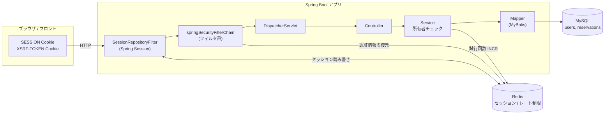
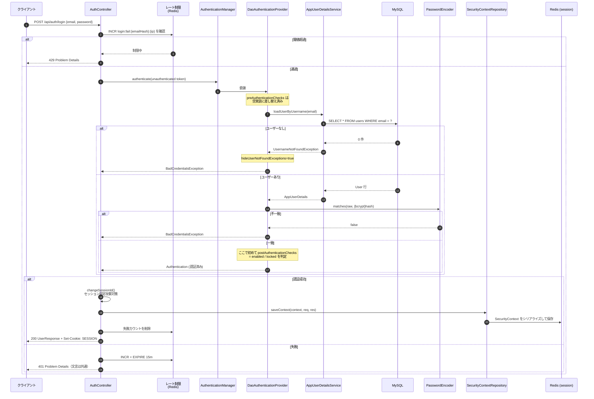
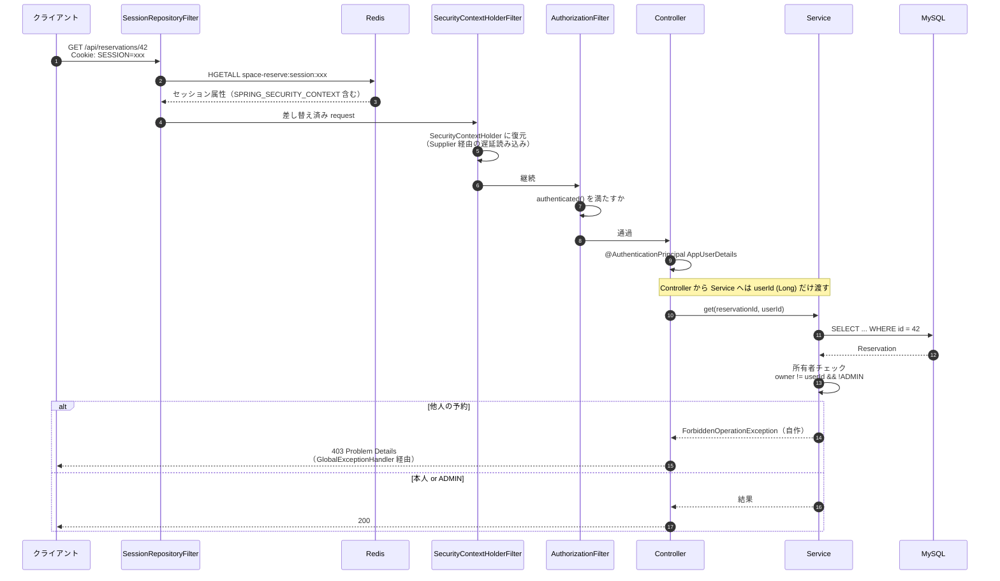
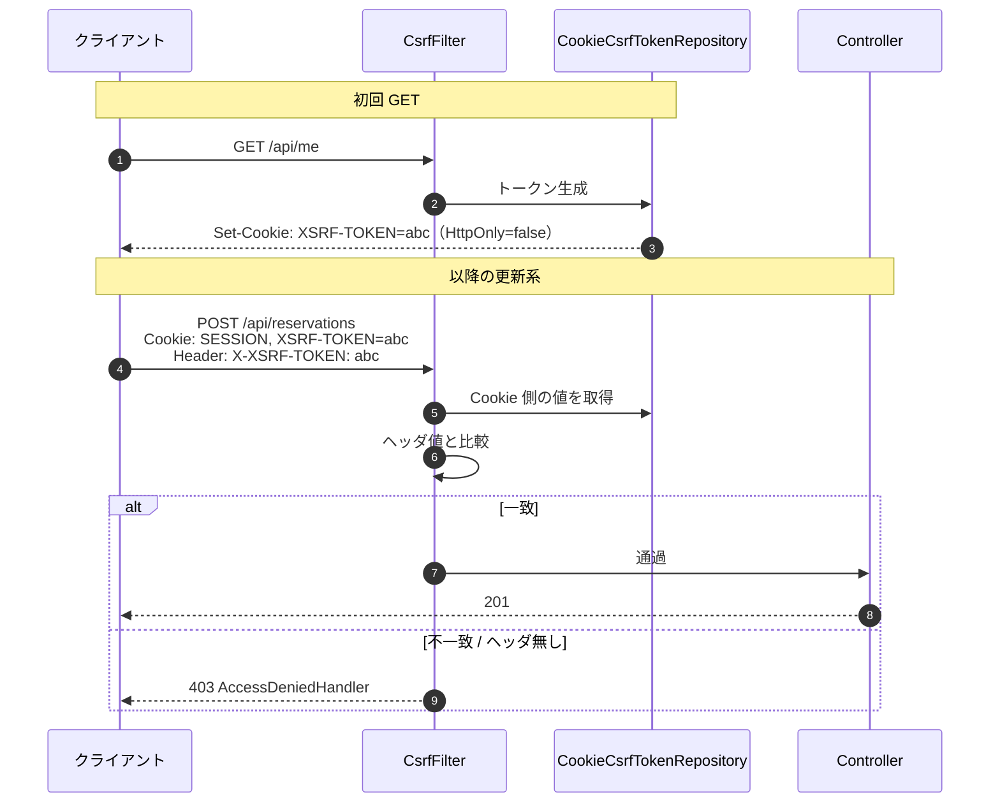
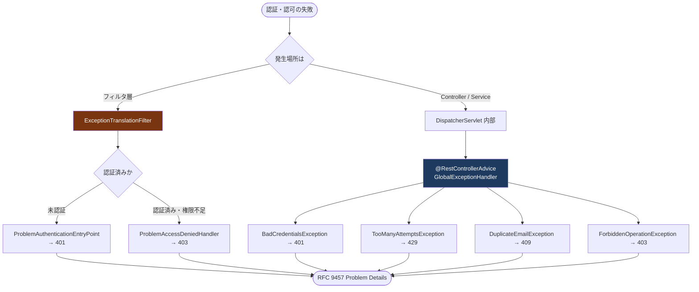
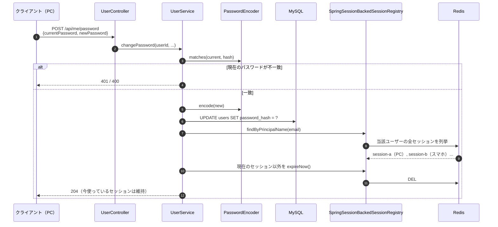
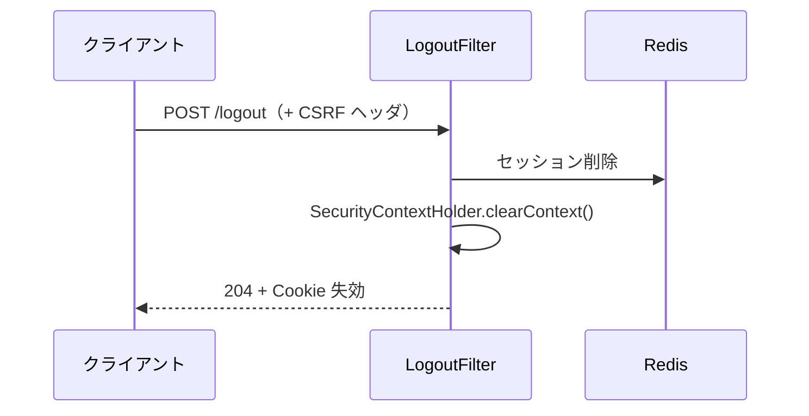

# 認証・認可 フロー図

`authentication.md` で決めた方針が、実行時に Spring Security のどの部品を通るのかを図にしたもの。
判断の根拠は書かない（そちらは `authentication.md`）。ここは **どこで何が起きるか** だけを扱う。

---

## 1. 全体構成



要点は2つ。

- **`SessionRepositoryFilter` は Security のフィルタ群より手前にいる。** Spring Session が `HttpServletRequest` を差し替えるので、以降の `getSession()` は全て Redis を向く。Security 側は自分が Redis を見ていることを知らない。
- **Redis は3用途を兼ねる**（セッション / ログイン失敗カウント / 登録レート制限）。だから `namespace` を明示する。

---

## 2. フィルタチェーンの並び

`formLogin` を使わないので `UsernamePasswordAuthenticationFilter` は**いない**。ログインは通常の Controller。


**`ExceptionTranslationFilter` が `AuthorizationFilter` より上流にいる**のがポイント。下流で投げられた `AccessDeniedException` をここで受け止め、「未認証なら 401、認証済みなら 403」に振り分ける。この分岐が 8 節の「所有者チェックに Spring の `AccessDeniedException` を使わない」理由。

---

## 3. ログイン



赤線を引くところ:

- **`saveContext` を自分で呼ぶ。** `formLogin` を使わない代償。忘れるとログインは 200 で返るのに、次のリクエストが 401 になる。
- **`enabled` の判定はパスワード照合の後。** 既定の順序のままだと、パスワードが違っても「無効なアカウント」と返ってアドレスの存在が漏れる。
- **失敗系の応答はすべて同じ形。** 「存在しない」と「パスワード違い」を区別しない。

---

## 4. 認証済みリクエスト（GET）



**所有者チェックだけが Service 層にある**のは、対象レコードを読まないと判定できないから。URL とロールだけで決まる制御（`/api/admin/**`）は `AuthorizationFilter` の側で終わる。

---

## 5. CSRF（更新系リクエスト）



罠サイトはクロスオリジンのため **Cookie は自動送信できてもその値を JS から読んでヘッダに載せることができない**。この非対称性が防御の本体。したがってフロントは「Cookie を読んでヘッダに詰め直す」実装が必須になる。

---

## 6. 401 / 403 の2経路

同じステータスでも、**どこで発生したかで通る道が違う**。ここを揃えないと Problem Details に統一したはずの応答が崩れる。



**`@RestControllerAdvice` はフィルタ層に届かない。** 保護リソースへの未認証アクセスは DispatcherServlet の手前で弾かれるため、`ProblemAuthenticationEntryPoint` / `ProblemAccessDeniedHandler` を書かないと 401/403 だけ Spring 既定の形式で返る。

---

## 7. ユーザー登録

```mermaid
flowchart TD
    A([POST /api/users]) --> B{Bean Validation<br/>email 形式 / 12〜64 文字}
    B -->|NG| E400["400 errors マップ付き"]
    B -->|OK| C{IP レート制限<br/>Redis INCR}
    C -->|超過| E429["429"]
    C -->|OK| D{ドメイン許可リスト<br/>@company.co.jp か}
    D -->|不許可| E400b["400"]
    D -->|許可| F{email 重複<br/>uk_users_email}
    F -->|重複| E409["409 DuplicateEmailException"]
    F -->|新規| G["passwordEncoder.encode()<br/>→ {bcrypt}$2a$10$..."]
    G --> H["INSERT INTO users<br/>role=USER, enabled=true"]
    H --> I([201 Created])

    style E400 fill:#7f1d1d,color:#fff
    style E400b fill:#7f1d1d,color:#fff
    style E409 fill:#7f1d1d,color:#fff
    style E429 fill:#7f1d1d,color:#fff
```

メール検証の関門が無いぶん、**ドメイン許可リストと IP レート制限の2つが唯一の防御線**になる。

---

## 8. パスワード変更 — 他セッションの無効化



**現在のパスワードを必ず要求する**のは、セッションを乗っ取られたときにパスワードごと奪われるのを防ぐため。そして奪われていた場合に備え、変更後は他セッションを全て切る。この一括無効化はセッションが Redis に集約されているからこそ確実に効く。

管理者によるパスワード再発行（`POST /api/admin/users/{id}/reset-password`）も、最後のセッション無効化の部分は同じ処理を通る。

---

## 9. ログアウト



セッション方式を選んだ結果、**失効はここで即座に完了する**。JWT のようにブラックリストを持つ必要がない。これが 1 節で JWT を落とした理由そのもの。

---

## 参照

- 判断の根拠・却下した案・引き受けたリスク → [authentication.md](authentication.md)
- 実装順 → 同 12 節
